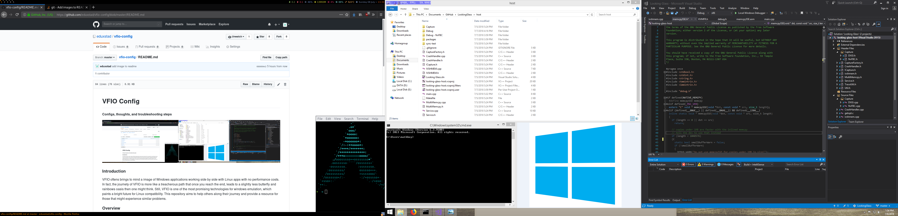

# VFIO Config
#### Configs, thoughts, and troubleshooting steps



### Introduction
VFIO oftens brings to mind an image of Windows applications working side by side with Linux apps with no performance costs. In fact, the journety of VFIO is more like a treacherous path that once you reach the end, leads to a slightly less butterfly and rainbows oasis then one might think. Still, VFIO is one of the most promising technologies for windows emulation, which paints a bright future for Linux compatibility. This repository aims to help others along their journey and provide a resource for those that might experience similar problems. 

### Overview
This setup was created using the ['PCI passthrough via OVMF'](https://wiki.archlinux.org/index.php/PCI_passthrough_via_OVMF) page on the Arch Linux wiki, of course using the latest version of Arch Linux. That page will most likely be more up-to-date than this repository, and it is recommended to use it as a primary resource. Parts were also configured using the [VFIO Increments](https://passthroughpo.st/vfio-increments/) page. Libvirt and virt-manager were used to configure the VM, with manual editing of with the virsh command. Vfio-pci was used to isolate the GPU. 

### System Specs
* **Motherboard:** ASUS Prime B350-PLUS
* **CPU:** Ryzen 2600X @ 3.7 GHZ
* **RAM:** 2 x 8GB (16GB) @ 3000 HZ
* **GPU1 (Guest):** MSI 390 8GB @ Stock
* **GPU2 (Host):** XFX 550 4GB @ Stock
* **Storage:** 2 x 250GB Intel SSD, 1 x 1TB Seagate HHD†*
* **OS (Guest):** Windows 8.1 Embedded Pro
* **OS (Host):** Arch Linux

† *Both the Host and Guest drives are stored on one SSD with the other drives serving as supplemental storage.*

### Troubleshooting
#### B350-Plus Motherboard
The B350-PLUS serves as a good budget option for VFIO, although it has some caveats. It's GPU IOMMU groups are as follows (all groups in the iommu file): 
```
IOMMU Group 12 01:00.0 USB controller [0c03]: Advanced Micro Devices, Inc. [AMD] USB 3.1 XHCI Controller [1022:43bb] (rev 02)
IOMMU Group 12 01:00.1 SATA controller [0106]: Advanced Micro Devices, Inc. [AMD] 300 Series Chipset SATA Controller [1022:43b7] (rev 02)
IOMMU Group 12 01:00.2 PCI bridge [0604]: Advanced Micro Devices, Inc. [AMD] Device [1022:43b2] (rev 02)
IOMMU Group 12 02:00.0 PCI bridge [0604]: Advanced Micro Devices, Inc. [AMD] 300 Series Chipset PCIe Port [1022:43b4] (rev 02)
IOMMU Group 12 02:01.0 PCI bridge [0604]: Advanced Micro Devices, Inc. [AMD] 300 Series Chipset PCIe Port [1022:43b4] (rev 02)
IOMMU Group 12 02:04.0 PCI bridge [0604]: Advanced Micro Devices, Inc. [AMD] 300 Series Chipset PCIe Port [1022:43b4] (rev 02)
IOMMU Group 12 03:00.0 Ethernet controller [0200]: Realtek Semiconductor Co., Ltd. RTL8111/8168/8411 PCI Express Gigabit Ethernet Controller [10ec:8168] (rev 15)
IOMMU Group 12 04:00.0 PCI bridge [0604]: ASMedia Technology Inc. ASM1083/1085 PCIe to PCI Bridge [1b21:1080] (rev 04)
IOMMU Group 12 06:00.0 VGA compatible controller [0300]: NVIDIA Corporation GK208 [GeForce GT 710B] [10de:128b] (rev a1)
IOMMU Group 12 06:00.1 Audio device [0403]: NVIDIA Corporation GK208 HDMI/DP Audio Controller [10de:0e0f] (rev a1)
IOMMU Group 13 07:00.0 VGA compatible controller [0300]: Advanced Micro Devices, Inc. [AMD/ATI] Hawaii PRO [Radeon R9 290/390] [1002:67b1] (rev 80)
IOMMU Group 13 07:00.1 Audio device [0403]: Advanced Micro Devices, Inc. [AMD/ATI] Hawaii HDMI Audio [Radeon R9 290/290X / 390/390X] [1002:aac8]
```
As you can see, the guest GPU is fully isolated, which is good, but the host GPU is not isolated at all! This turns out ok, as we do not need the host GPU to be isolated, although it would be nice and is a feature on higher end motherboards such as the ASUS Prime X370-PRO. Another downside to the motherboard is that it does not allow you to select which GPU should be used for video output. Instead, you must turn off CSM (Compatability Support Module) so that you can boot using the CPU. To be specific, these are the two settings I change to boot into my vfio configuration.
```
IOMMU Disabled/Auto -> Enabled
CSM Enabled -> Disabled
```
#### Network error upon trying to boot vm with virt-manager
If the network is not started and you receive this error: ```Error starting domain: Requested operation is not valid: network 'default' is not active``` You can use this command to start the network: 
``` $ sudo virsh net-start default ```
#### Spice server config
When using the Spice server, it may be useful to set the associated video output to VMVGA (or any other output that doesn't work) to avoid it interfering with the vm's host video setup. The spice server is mainly enabled to use as another source of imput as you can click on the nonfunctional graphical console to capture the mouse and keyboard (and use ctrl + alt + l to escape)
#### Configuring hardware and dedicated drives
Using dedicated drives in a vm is a two part process. First, the drives must be configured as disk in the XML configuration. Example:
```
<devices>
...
  <disk type='block' device='disk'>
    <driver name='qemu' type='raw' cache='none' io='native'/>
    <source dev='/dev/sdc2'/>
    <target dev='sda' bus='scsi'/>
    <address type='drive' controller='0' bus='0' target='0' unit='0'/>
  </disk>
...
</devices>

```
Then a Virtio SCSI controller must be configured in virt-manager ('Add Hardware' -> 'Controller' -> 'SCSI'). Finally, you must go into the vm and install special drivers for the SCSI controller that should show up in Device Manager. Those drivers can be located in the iso here: https://fedorapeople.org/groups/virt/virtio-win/direct-downloads/archive-virtio/virtio-win-0.1.149-2/ .
#### VFIO Boot Profile cannot find boot partition
If your boot profile stops booting while complaining that it cannot find the boot device, but your other profiles boot fine with the same description, you must [regenerate the initramfs](https://wiki.archlinux.org/index.php/Regenerate_the_initramfs). Example boot error: 
```
Waiting 10 seconds for device /dev/sda1 ...
ERROR: device '/dev/sda1' not found. Skipping fsck.
```
#### Lib-virt fails to start
If the libvirtd.service daemon fails to start, there is most likely an error in your ```/etc/libvert/qemu.conf``` figule. Make sure to double check that it is correct. 
### Looking Glass
Looking Glass is a powerful tool that allows Windows and Linux applications to live side by side, but requires a little extra configuration. One change to note is the 64MB shared memory buffer used to facilitate a ultrawide (2560x1080) display. 
```
size unit='M'>64</size>
```
#### Blue screen upon starting looking-glass-client
A blue screen for looking glass is simply displayed when the client is waiting for the host to start relaying frames. Make sure that the host is correctly configured, and looking-glass-host is running. 
#### IVSHMEM Drivers for Windows 8.1
The default looking glass drivers are only for Windows 10. The windows 8.1 drivers are also included in [this](https://github.com/virtio-win/kvm-guest-drivers-windows/issues/217) github issue. 
